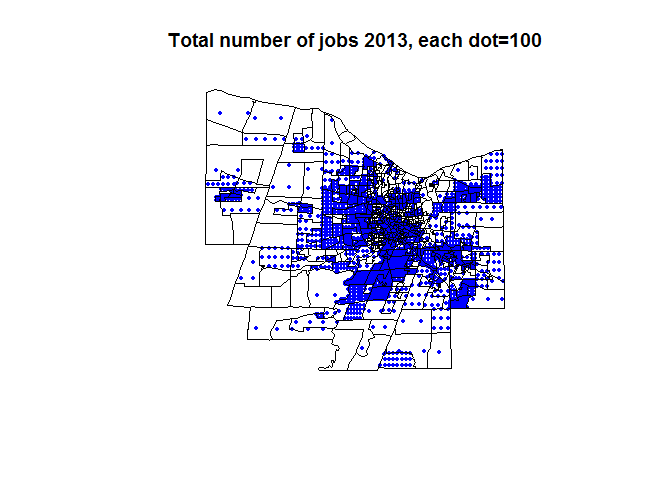
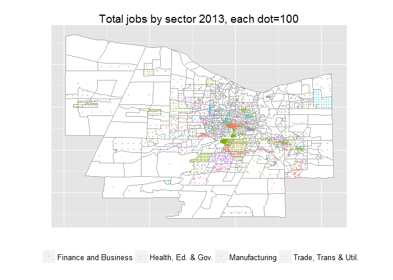
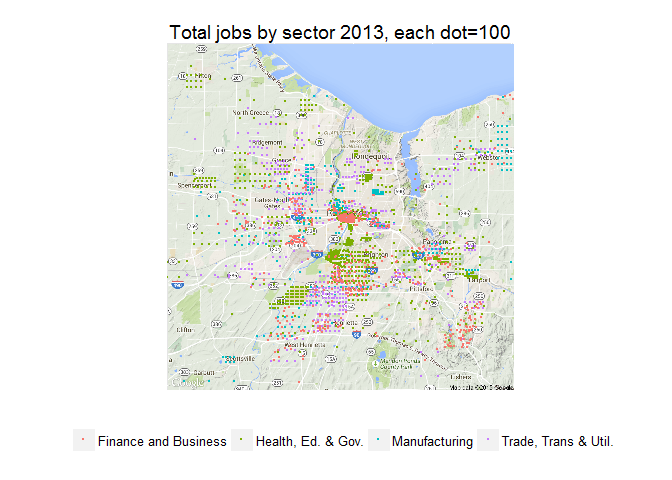

# How to Make a Dot Density Map
by Mike Silva  
August 20, 2015  

This R Markdown document explains what you need to do in order to create a dot density map.  It is "self-contained" meaning that it will download all files you will need.  Inspiration for this dot density map comes from [Robert Manduca's map](http://www.robertmanduca.com/projects/jobs.html)

## Step 1: Install Necessary Packages

In order to create the dot density map you will need to have the following packages installed:


```r
install.packages('R.utils')
install.packages('dplyr')
install.packages('rgdal')
install.packages('maptools')
install.packages('ggplot2')
install.packages('ggmap') 
```

## Step 2: Download the Data

To create this map I will be using the [Longitudinal Employer-Household Dynamics Origin-Destination Employment Statistics (LODES)](http://lehd.ces.census.gov/data/) produced by the U.S. Census Bureau.  Since I live near Rochester New York I will be producing a map for my local county.  First I will need to download the LODES data and a geographic crosswalk:


```r
url <- 'http://lehd.ces.census.gov/data/lodes/LODES7/ny/wac/ny_wac_S000_JT00_2013.csv.gz'

geography.crosswalk.url <- 'http://lehd.ces.census.gov/data/lodes/LODES7/ny/ny_xwalk.csv.gz'

download.file(url, 'lodes.csv.gz')
download.file(geography.crosswalk.url, 'xwalk.csv.gz')
```

According to the [techical documentation](http://lehd.ces.census.gov/data/lodes/LODES7/LODESTechDoc7.1.pdf) the LODES version 7.1 is enumerated with 2010 census blocks.  I will need to [download the census block shapefiles](https://www.census.gov/geo/maps-data/data/cbf/cbf_blkgrp.html):


```r
shapefile.url <- 'http://www2.census.gov/geo/tiger/GENZ2010/gz_2010_36_150_00_500k.zip'
download.file(shapefile.url, 'shapefile.zip')
```

## Step 3: Decompress the Downloaded Data

Since the shapefiles and LODES data is compressed the next step is to decompress it:


```r
library(R.utils)
gunzip('lodes.csv.gz')
gunzip('xwalk.csv.gz')
unzip('shapefile.zip')
```

## Step 4: Load the Data into R

Now that we have uncompressed data we need to load it into R.  The [techical documentation](http://lehd.ces.census.gov/data/lodes/LODES7/LODESTechDoc7.1.pdf) states that the first variable (w_geocode) is a 15 character string and all other variables are numbers.  The default read.csv does not read it in correctly so we will need to parse the file using the colClasses:


```r
lodes <- read.csv('lodes.csv', nrows = 1)
col.classes <- c('character', rep('numeric', ncol(lodes)-1))
lodes <- read.csv('lodes.csv', colClasses = col.classes)
```

Now we need to load in the geography crosswalk.  Once again refering to the [techical documentation](http://lehd.ces.census.gov/data/lodes/LODES7/LODESTechDoc7.1.pdf) we see that all variables are character strings.  The default read.csv does not read it in correctly so we will need to parse the file again using the colClasses:


```r
xwalk <- read.csv('xwalk.csv', nrows=1)
col.classes <- rep('character', ncol(xwalk))
xwalk <- read.csv('xwalk.csv', colClasses = col.classes)
```

Currently I have 104593 records in the lodes data frame.  As previously stated I will be producing a map for my local county which is Monroe New York so I will not need all of them:


```r
library(dplyr)

lodes <- xwalk %>%
  filter(ctyname == 'Monroe County, NY') %>%
  select(tabblk2010) %>%
  rename(w_geocode = tabblk2010) %>%
  merge(., lodes)
```

So after filtering I have 3974 records in the lodes data frame.


## Step 5: Load the Shapefile into R

In order to merge the LODES data with the shapefile data frame I need to create a GEO_ID field.  The LODES data has more detail so we will need to aggregate it up:


```r
lodes <- lodes %>%
  mutate(GEO_ID = paste0('1500000US', w_geocode)) %>%
  mutate(GEO_ID = substr(GEO_ID,1,21)) %>%
  select(-w_geocode, -createdate) %>%
  group_by(GEO_ID) %>%
  summarise_each(funs(sum))
```

After aggregating, the lodes data frame has 600 records.  Now we can merge this into the shapefile:


```r
library(rgdal)
blocks <-  readOGR('.','gz_2010_36_150_00_500k')
```

```
## OGR data source with driver: ESRI Shapefile 
## Source: ".", layer: "gz_2010_36_150_00_500k"
## with 15444 features
## It has 8 fields
```

```r
# Only select Monroe County, NY
blocks <- blocks[blocks$COUNTY=='055',]
# Merge in LODES data
blocks@data = data.frame(blocks@data, lodes[match(blocks@data$GEO_ID, lodes$GEO_ID),])
```


# Step 6: Create the Dot Plot Maps

Now that we have the LODES data merged into the shapefile we can create our dot plot map.  In this example I will use the base plot function ([hat tip to Chris Inkpen](http://rstudio-pubs-static.s3.amazonaws.com/13730_f008288ab83c43ea978f222d0dfe8299.html)):


```r
library(maptools)
# This function will help clean and scale varriables
clean_vars <- function(var){
  var[is.na(var)] <- 0
  var / 100
}

# Create dot density map by getting total jobs
plotvar <- clean_vars(blocks@data$C000)
# Spread these dots evenly across the polygon's area
dots <- dotsInPolys(blocks, as.integer(plotvar), f='regular')
# Create the map
plot(blocks)
plot(dots, add = T, pch = 19, cex = 0.5, col = 'blue')
plot(blocks, add = T)
title('Total number of jobs 2013, each dot=100')
```

 

This is nice but we can create more interesting maps.  First let's create some sector employment data:


```r
# Use the clean_vars function described in the previous block
dots.a <- dotsInPolys(blocks, as.integer(clean_vars(blocks@data$CNS05)), f = 'regular')
dots.a$sector <-'Manufacturing'

dots.b <- dotsInPolys(blocks, as.integer(clean_vars(blocks@data$CNS03 + blocks@data$CNS06 + blocks@data$CNS07 + blocks@data$CNS08)), f = 'regular')
dots.b$sector <-'Trade, Trans & Util.'

dots.c <- dotsInPolys(blocks, as.integer(clean_vars(blocks@data$CNS15 + blocks@data$CNS16 + blocks@data$CNS20)), f = 'regular')
dots.c$sector <-'Health, Ed. & Gov.'

dots.d <- dotsInPolys(blocks, as.integer(clean_vars(blocks@data$CNS10 + blocks@data$CNS11 + blocks@data$CNS12 + blocks@data$CNS13 + blocks@data$CNS14)))
dots.d$sector <-'Finance and Business'

# Merge these points together into one object
dots <- spRbind(dots.a, dots.b) %>%
  spRbind(., dots.c) %>%
  spRbind(., dots.d)

# Create a data frame other packages can use
df <- data.frame(coordinates(dots)[,1:2], sector=dots$sector)
```


Now let's plot it using the ggplot2 package:


```r
library(ggplot2)
ggplot(blocks, aes(x = long, y = lat)) + 
  geom_polygon(aes(group = group), colour = I('grey65'), fill='white', size=0.2) + 
  coord_equal() +  
  geom_point(data=df, aes(x=x,y=y, colour = factor(sector)), size=0.8, alpha=0.5) + 
  theme(legend.position='bottom', legend.title=element_blank(), axis.ticks=element_blank(), axis.text=element_blank(), axis.title=element_blank()) +
  ggtitle('Total jobs by sector 2013, each dot=100')
```

 

Now what if we wanted to overlay the data on a Google Map?


```r
library(ggmap)
blocks <- blocks %>%
  spTransform(., CRS('+proj=longlat +datum=WGS84')) %>%
  fortify(.)

gmap <- get_map(c(lon=mean(blocks$lon), lat=mean(blocks$lat)),zoom=11)

ggmap(gmap) + 
  geom_point(data=df, aes(x=x,y=y, colour = factor(sector)), size=0.8) + 
  theme(legend.position='bottom', legend.title=element_blank(), axis.ticks=element_blank(), axis.text=element_blank(), axis.title=element_blank()) +
  ggtitle('Total jobs by sector 2013, each dot=100')
```

 
